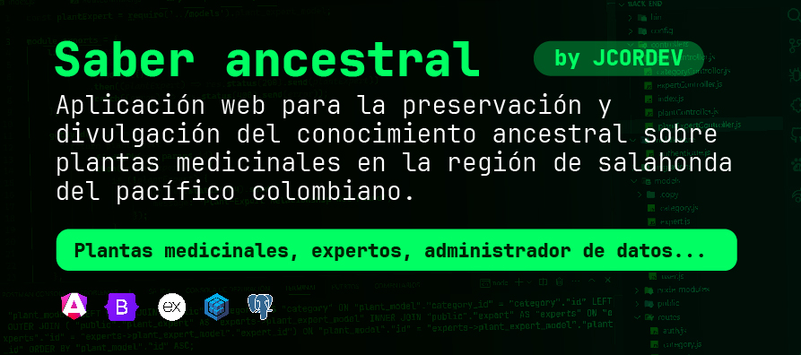
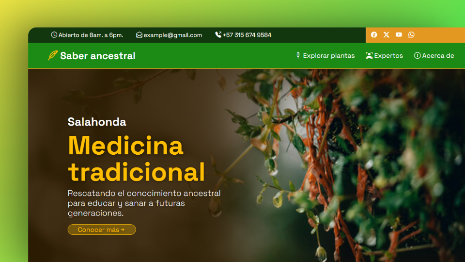
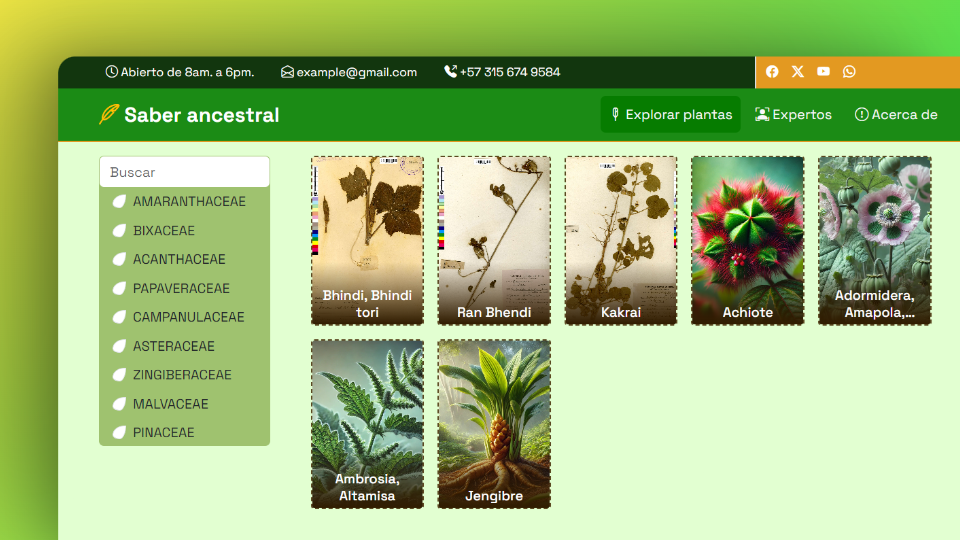
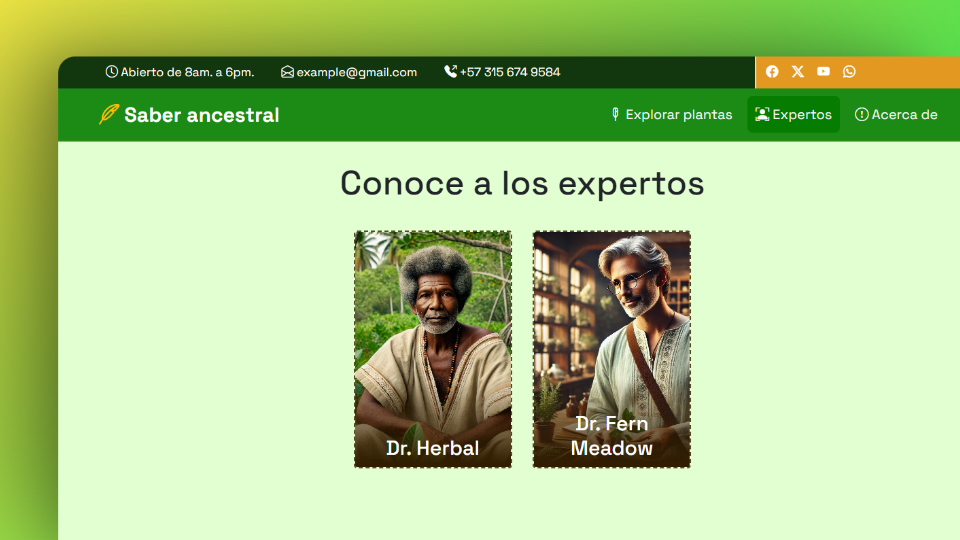
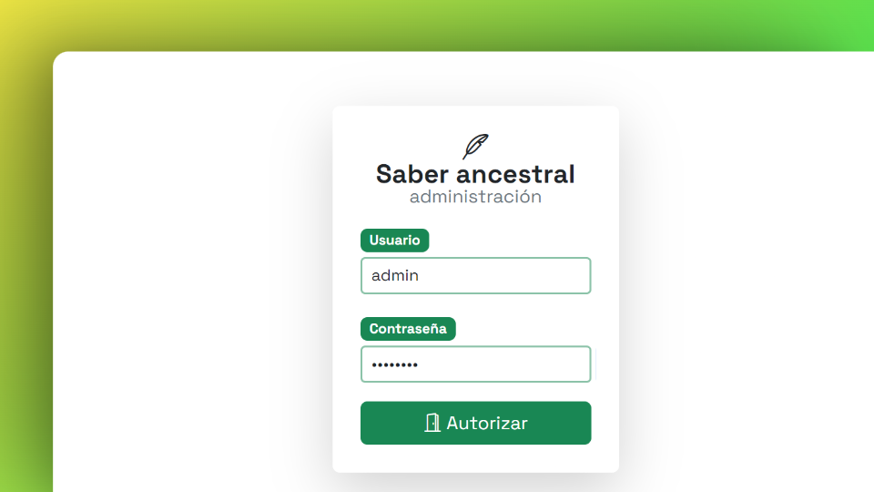
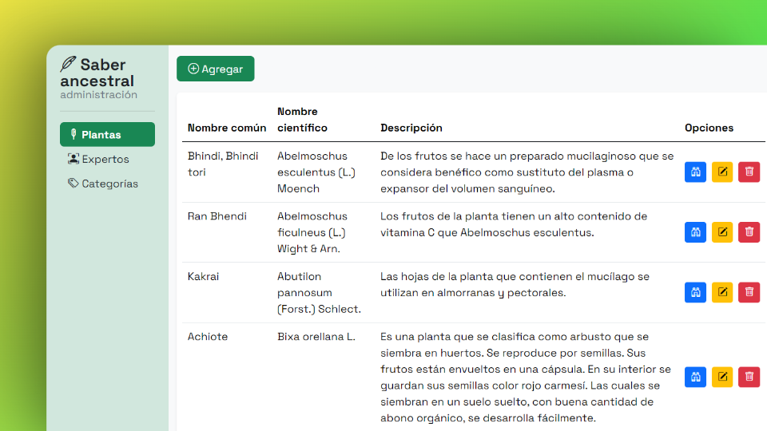

# 🌿Saber ancestral
Es una plataforma web desarrollada para preservar y divulgar el conocimiento ancestral de las plantas medicinales en la región de Salahonda, Colombia. Este proyecto busca conectar generaciones mediante la digitalización de saberes, promoviendo el acceso global a sus usos, beneficios y preparaciones tradicionales.



## 📚 Tabla de contenidos
- [🎯 Objetivo](#-objetivo)
- [⚙️ Tecnologías utilizadas](#️-tecnologías-utilizadas)
  - [Backend](#backend)
  - [Frontend](#frontend)
- [🖼️ Vista previa](#️-vista-previa)
- [🛠️ Instalación y configuración](#️-instalación-y-configuración)
- [✨ Características](#-características)
- [📌 Próximas funcionalidades](#-próximas-funcionalidades)
- [🖋️ Créditos](#️-créditos)

## 🎯 Objetivo

- `Preservar el conocimiento ancestral:` Documentar los usos y beneficios de las plantas medicinales de Salahonda.
- `Facilitar el acceso:` Proveer una plataforma amigable para consultar información sobre plantas, expertos y métodos de preparación.
- `Promover la colaboración:` Fomentar el aprendizaje y la participación activa de la comunidad local.

## ⚙️ Tecnologías utilizadas

### **Backend**


-52B0E7?style=for-the-badge&logo=Sequelize&logoColor=white)
-black?style=for-the-badge&logo=JSON%20web%20tokens)


### **Frontend**


 <br/>
`Diseño` centrado en la experiencia del usuario (UX/UI)

## 🖼️ Vista previa







## 🛠️ Instalación y configuración

1. Clona el repositorio:
   
    ```bash
    git clone https://github.com/JCORDEV/saber-ancestral.git
    ```

2. Accede al proyecto:
   
    ```bash
    cd saber-ancestral
    ```


3. Instala las dependencias:
    
    ```bash
    npm install
    ```

4. Configura las variables en el archivo `config/config.json` del backend:

    
    ```json
    {
        "development": {
            "username": "usuario",
            "password": "contraseña",
            "database": "base-de-datos",
            "host": "127.0.0.1",
            "dialect": "postgres"
        },
        "test": {
            "username": "usuario",
            "password": "contraseña",
            "database": "base-de-datos",
            "host": "127.0.0.1",
            "dialect": "postgres"
        },
        "production": {
            "username": "usuario",
            "password": "contraseña",
            "database": "base-de-datos",
            "host": "127.0.0.1",
            "dialect": "postgres"
        }
    }
    ```

5. Inicia el servidor:
   
    ```bash
    nodemon
    ```

## ✨ Características
- 📖`Base de datos`: Información detallada sobre plantas medicinales.
- ⚙️`CRUD`: Gestión completa de información de plantas y curanderos.
- 💻📱`Multiplataforma`: Compatible con dispositivos móviles y de escritorio.

## 📌 Próximas funcionalidades
- 🗺️`Mapa interactivo`: Para ubicar plantas medicinales y expertos locales.
- 🌐`Integración con API`: Obtener información adicional de plantas en tiempo real.
- 🔒`Mejoras en autenticación`: Proteger datos sensibles y garantizar la privacidad.

## 🖋️ Créditos
Proyecto desarrollado por **[JCORDEV](https://github.com/JCORDEV)**.